# Code Stats 架构文档

## 目录结构

```
code-stats/
├── code_statistics.py      # 入口脚本（向后兼容）
├── pyproject.toml          # 项目配置
├── src/
│   └── code_stats/         # 核心包
│       ├── __init__.py
│       ├── __main__.py     # python -m 入口
│       ├── cli.py          # 命令行解析
│       ├── core.py         # 核心协调类
│       ├── config.py       # 配置加载
│       ├── analyzers/      # 分析器模块
│       ├── filters/        # 过滤器模块
│       ├── outputs/        # 输出模块
│       ├── constants/      # 常量定义
│       ├── git/            # Git 集成
│       └── utils/          # 工具函数
└── tests/                  # 测试目录
```

## 系统架构图

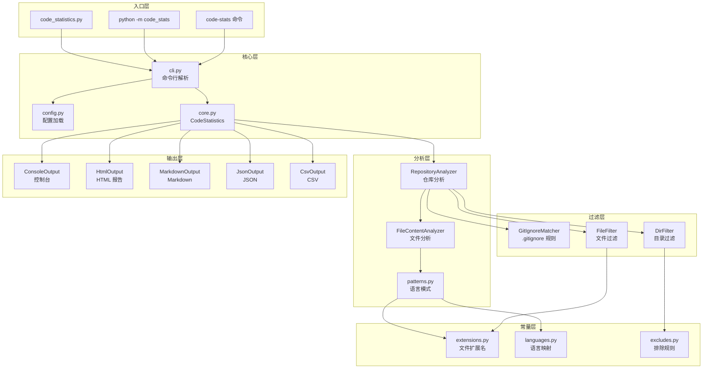

## 核心流程

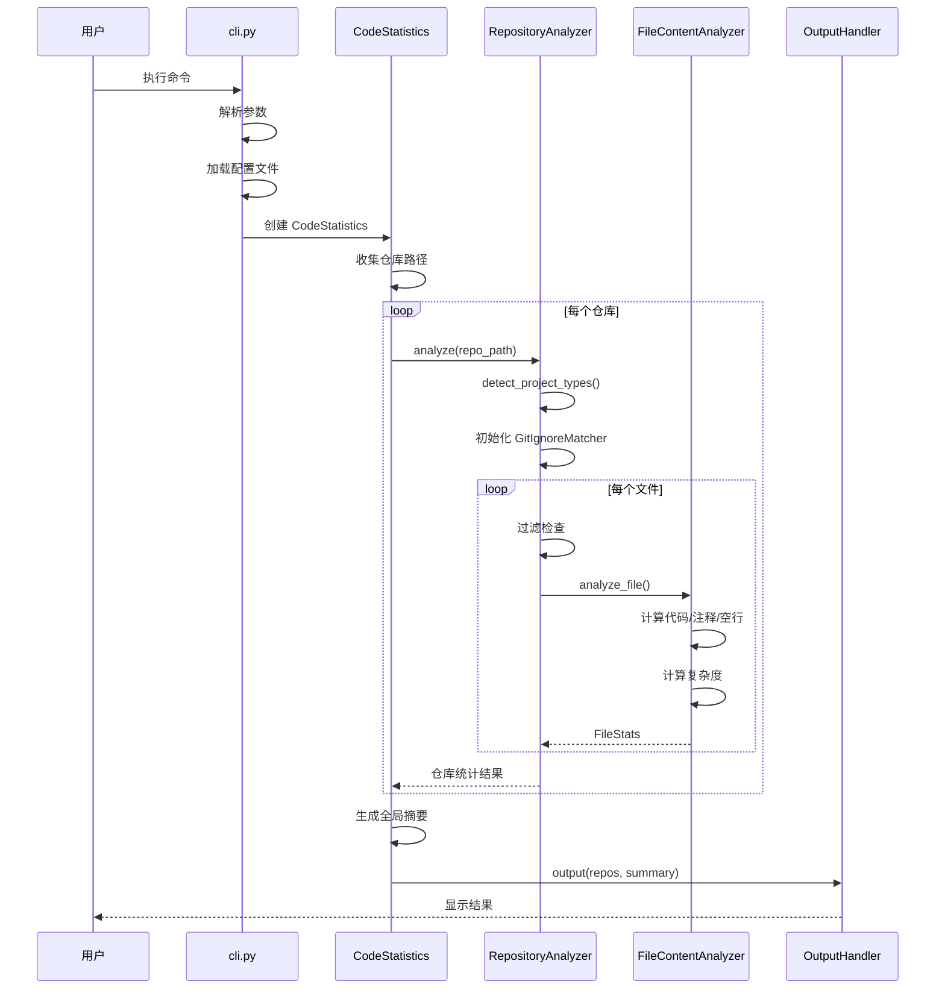

## 模块详解

### 1. 分析器模块 (analyzers/)

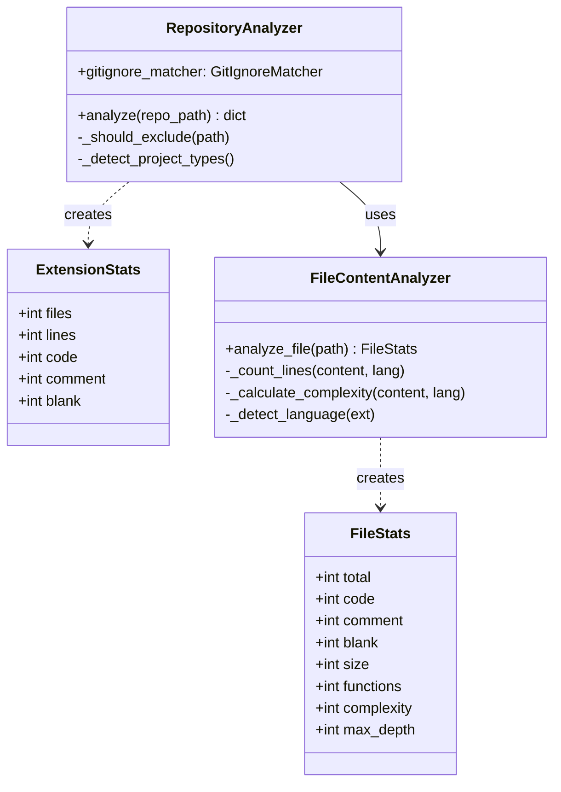

### 2. 过滤器模块 (filters/)

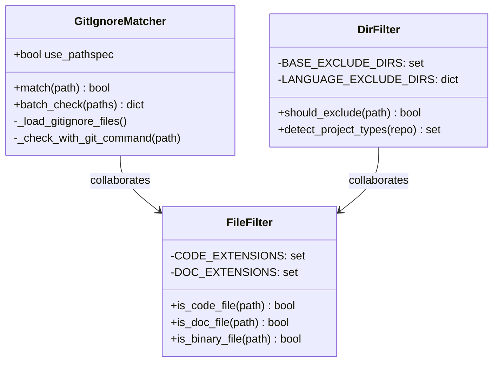

### 3. 输出模块 (outputs/)

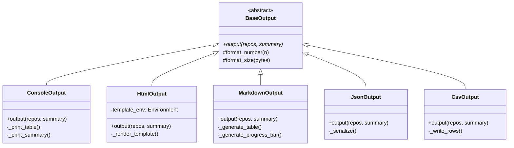

## 数据流图

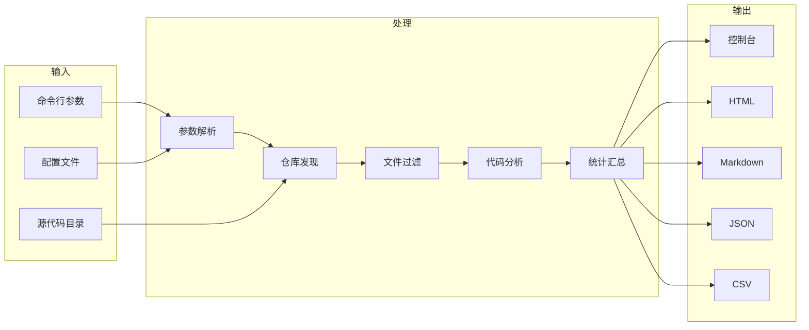

## 语言分析流程

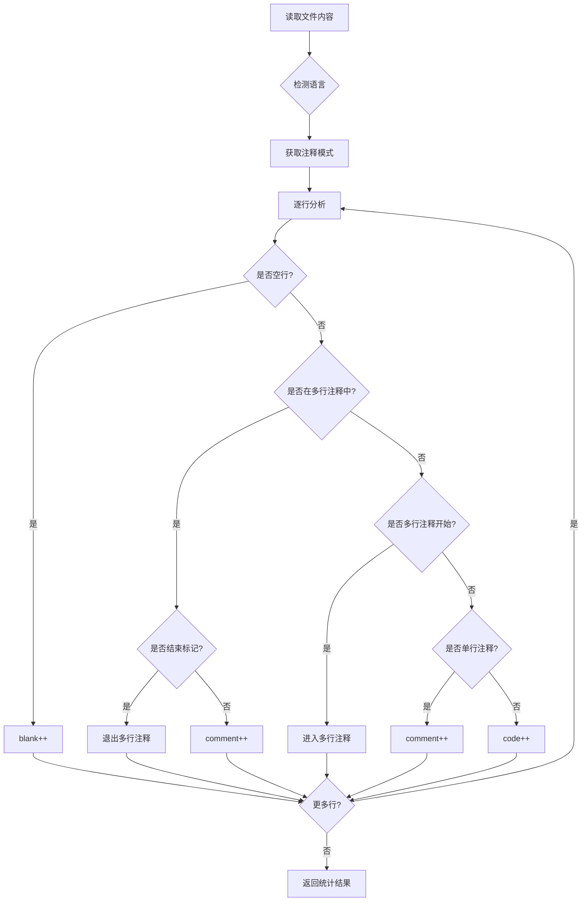

## 智能排除机制

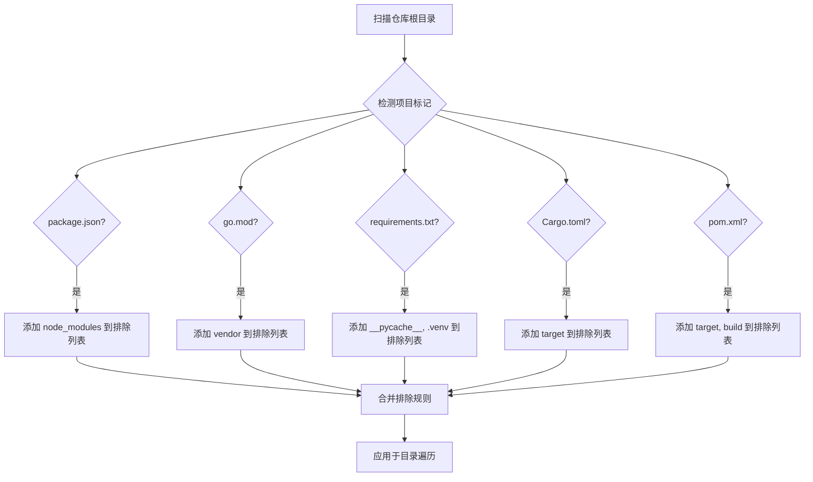

## 复杂度计算

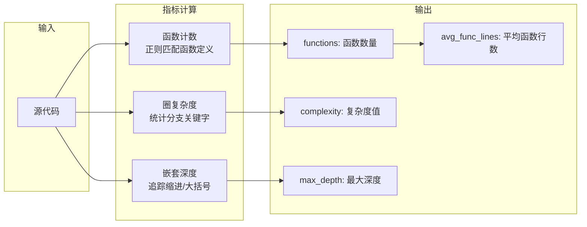

## 配置优先级

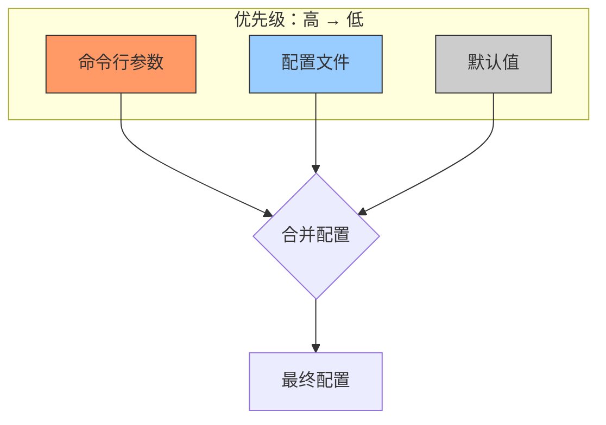

## 并行处理架构

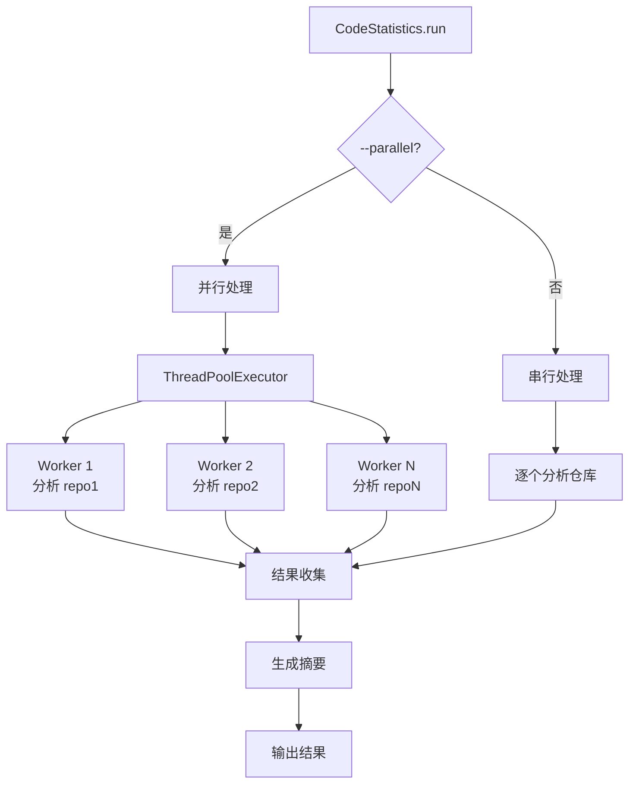

## 扩展点

### 添加新语言支持

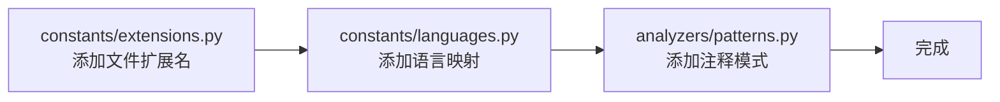

### 添加新输出格式


## 依赖关系

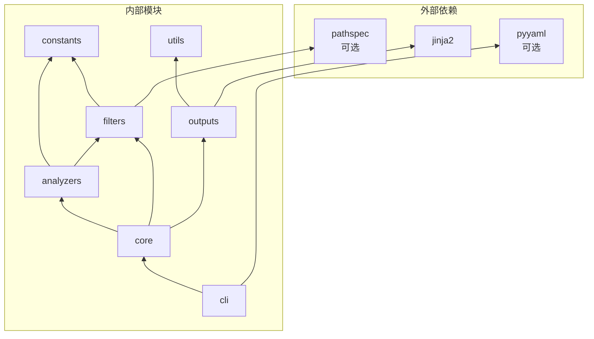
